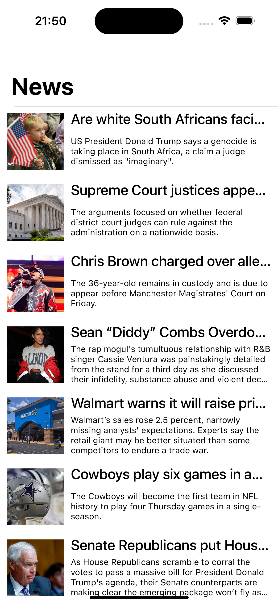

# the-news-app
A simple app that shows top headlines in US, and the inspiration come this tutorial by iOS Academy

I used the Design Pattern [MVC](https://www.devmedia.com.br/introducao-ao-padrao-mvc/29308)

Internal libraries:
- [Codable](https://developer.apple.com/documentation/foundation/archives_and_serialization/encoding_and_decoding_custom_types)

## Build the app on your machine
Before opening the app on the machine, it is necessary to:

Xcode 16 or higher.

## Operation
On the first screen of the app, an API joke is displayed [Chuck Norris Jokes Api] (https://api.chucknorris.io/), where they have four buttons:
- Save, share, view the next joke and the list of jokes. Where the saved jokes will be displayed.
- In the list of jokes, it is possible to view it and also delete it.

## Observation
App developed by @leticiafaleia
